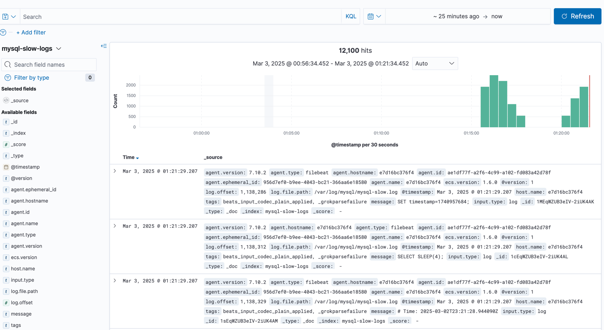
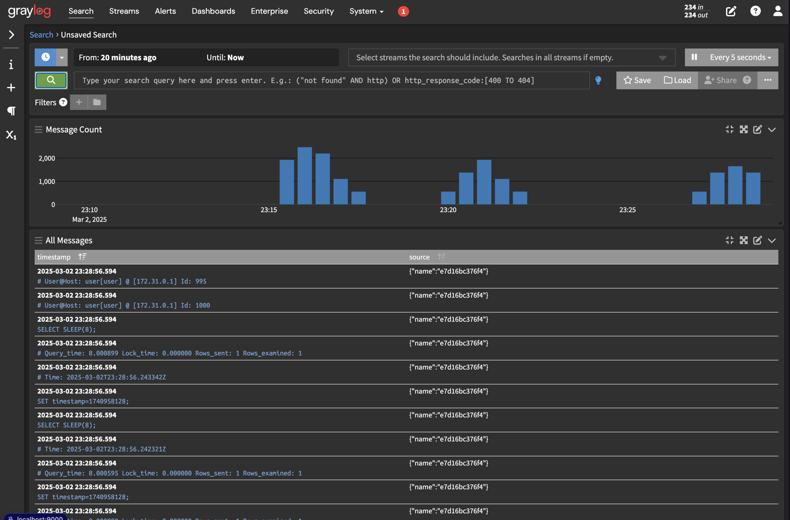

# 📌 MySQL Slow Query Log Performance Testing

## 🚀 Overview
This test evaluates the impact of different `long_query_time` settings and disabling the slow query log entirely in MySQL. The benchmarking was performed using `siege` with 100 concurrent users over 60 seconds.

### 🛠 Test Configuration
- **Tool**: `siege`
- **Concurrent Requests**: `100`
- **Test Duration**: `60s`
- **Query Executed**: 
```go
  for i := 1; i <= 10; i++ {
    var result string
    err := db.QueryRow(fmt.Sprintf("SELECT SLEEP(%d)", i)).Scan(&result)
    if err != nil {
      http.Error(w, fmt.Sprintln(err), http.StatusInternalServerError)
      return
    }
  }
```
  - **MySQL Settings**:
    - `long_query_time = 10.0`
    - `long_query_time = 1.0`
    - `slow_query_log = OFF`

---

## 📊 Test Results

### 🔹 `long_query_time = 10.0`
```
Transactions:                 100    hits
Availability:                 100.00 %
Elapsed time:                  60.13 secs
Response time:              55077.52 ms
Transaction rate:               1.66 trans/sec
Concurrency:                   91.60
Successful transactions:      100
Failed transactions:            0
Longest transaction:        55090.00 ms
Shortest transaction:       55060.00 ms
```

---

### 🔹 `long_query_time = 1.0`
```
Transactions:                 100    hits
Availability:                 100.00 %
Elapsed time:                  60.20 secs
Response time:              55291.22 ms
Transaction rate:               1.66 trans/sec
Concurrency:                   91.85
Successful transactions:      100
Failed transactions:            0
Longest transaction:        60110.00 ms
Shortest transaction:       55080.00 ms
```
📌 **Summary**: The *Response time* increased by 213.7 ms (55291.22 - 55077.52) when long_query_time was set to 1.0,

---

### 🔹 `slow_query_log = OFF`
```
Transactions:                 100    hits
Availability:                 100.00 %
Elapsed time:                  60.12 secs
Response time:              55098.04 ms
Transaction rate:               1.66 trans/sec
Concurrency:                   91.65
Successful transactions:      100
Failed transactions:            0
Longest transaction:        55100.00 ms
Shortest transaction:       55090.00 ms
```
📌 **Summary**: Interested behavior, the *Response time* is almost the same as the `long_query_time = 10.0` setting.

Example logs entry in Kibana:


Example logs entry in Graylog:
